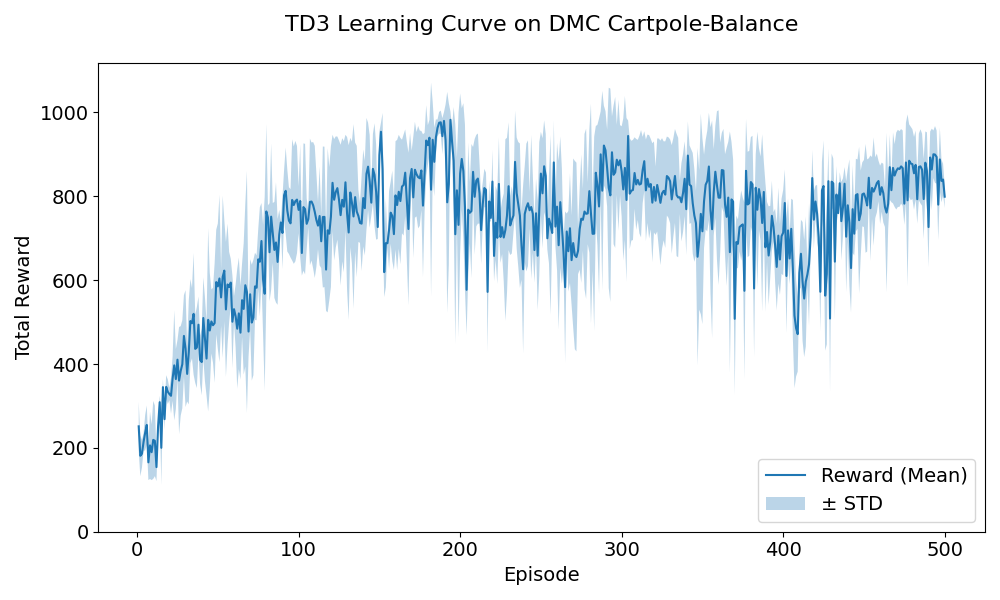
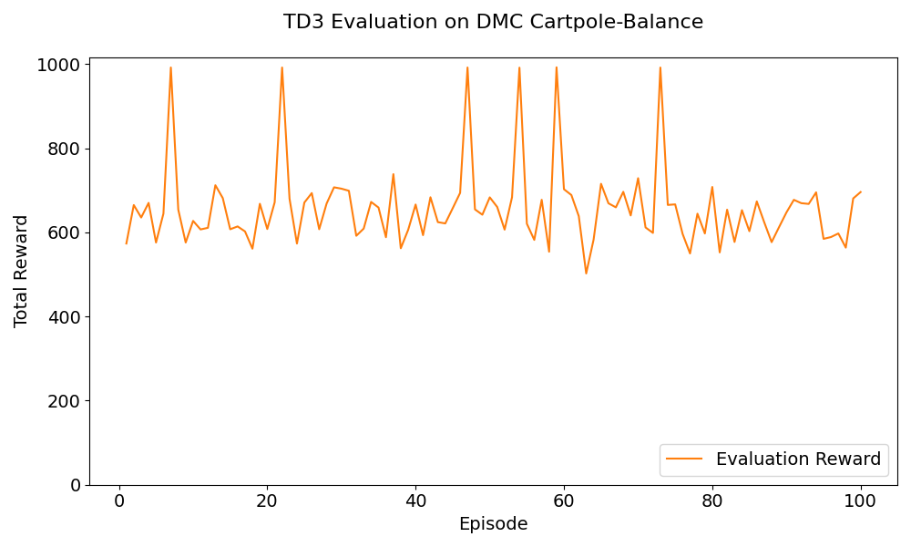

# TD3 for DeepMind Control Suite Cartpole-Balance

## 📝 Abstract

- This project implements the **Twin Delayed Deep Deterministic Policy Gradient (TD3)** algorithm for continuous control in the DeepMind Control Suite's Cartpole-Balance task.  
- The agent learns to balance the pole by interacting with the environment, observing state transitions, and optimizing its policy using deep reinforcement learning.  
- This implementation is from scratch, following the canonical TD3 algorithm, and is designed for reproducibility and clarity in educational and research settings.
- The code is compatible with the [DeepMind Control Suite](https://github.com/deepmind/dm_control) and is structured for easy experimentation with different seeds, hyperparameters, and evaluation protocols.

---

## ⚙️ Installation

### **Python 3.8+** is recommended.

**Install required packages:**
```
pip install -r requirements.txt
```
Or, manually:
```
pip install torch numpy matplotlib dm_control
```

---

## 🚀 How to Run

### **Train the TD3 agent:**

```
python main.py
```

- This will train the agent on DMC Cartpole-Balance using seeds `[0, 1, 2]`, log training progress, and plot the learning curve.

- **Evaluate the trained policy:**
    - Evaluation is performed automatically after training using test seed `10`.
    - The evaluation curve is saved as `td3_eval_curve.png`.

### **TD3 Hyperparameters**

| Hyperparameter     | Value   | Description                          |
|--------------------|---------|--------------------------------------|
| `gamma`            | 0.99    | Discount factor for future rewards   |
| `tau`              | 0.005   | Polyak averaging coefficient         |
| `policy_noise`     | 0.2     | Std of target policy smoothing noise |
| `noise_clip`       | 0.5     | Range to clip target policy noise    |
| `policy_freq`      | 2       | Frequency of delayed policy updates  |
| `actor_lr`         | 3e-4    | Learning rate for actor              |
| `critic_lr`        | 3e-4    | Learning rate for critic             |
| `buffer_capacity`  | 100,000 | Size of replay buffer                |
| `batch_size`       | 256     | Mini-batch size for updates          |
| `max_action`       | 1.0     | Action scaling (from env)            |

---
## 📂 Project Structure


- `main.py`:            Entry point - training and evaluation logic
- `td3_agent.py`:       TD3 agent class
- `actor_critic.py`:    Actor and Critic neural networks
- `replay_buffer.py`:   Experience replay buffer
- `config.py`:          Hyperparameter configuration class
- `requirements.txt`:   Python dependencies
- `README.md`:          Project documentation

## 📊 Results

- **Training:**  
  The reward learning curve (`mean ± std over 3 seeds`) is saved as `td3_learning_curve.png`.

  

- **Evaluation:**  
  The evaluation curve (for `seed 10`) is saved as `td3_eval_curve.png`.

  


